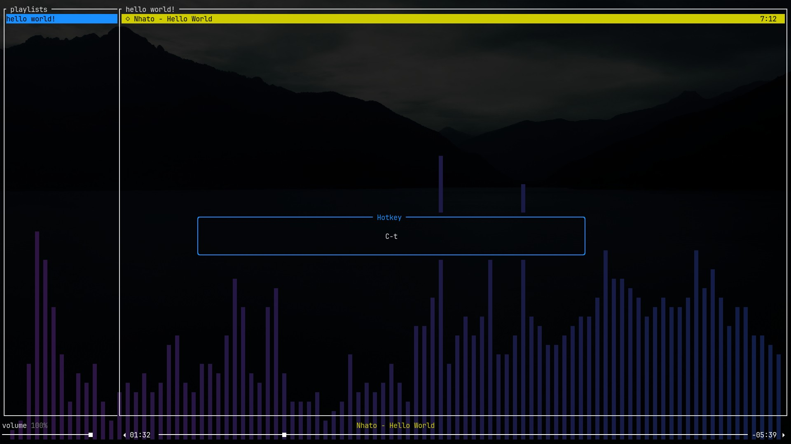

# Configuration
All of tori's configuration is defined in $CONFIG_DIR/tori.yaml, where $CONFIG_DIR is,
depending on your operating system:

| Platform | Value                                 | Example                                  |
| -------  | ------------------------------------- | ---------------------------------------- |
| Linux    | `$XDG_CONFIG_HOME` or `$HOME`/.config | /home/alice/.config                      |
| macOS    | `$HOME`/Library/Application Support   | /Users/Alice/Library/Application Support |
| Windows  | `{FOLDERID_LocalAppData}`             | C:\Users\Alice\AppData\Local             |

## Commands

Every configurable action in tori is called a "command". A list of your current key bindings can be
opened by pressing `?`. The bindings are in the format `<hotkey>: <command>`.


If you want to know what text tori uses to represent a given hotkey (for example, whether it's 
'Ctrl+Space', 'C- ' or 'C-space'), use the "Hotkey Modal" by pressing `!` and then the key you
want to test.



The list of all commands can be found [at docs.rs](https://docs.rs/tori/latest/tori/command/enum.Command.html).

## Defaults

The default directory tori uses to store playlists depends on your OS:

| Platform | Value                   | Example                   |
| -------  | ------------------      | --------------------      |
| Linux    | `XDG_MUSIC_DIR`/tori    | /home/alice/Music/tori    |
| macOS    | `$HOME`/Music/tori      | /Users/Alice/Music/tori   |
| Windows  | `{FOLDERID_Music}`/tori | C:\Users\Alice\Music\tori |

Here's the default configuration file:
```yaml
playlists_dir: {audio_dir described in the above table}
visualizer_gradient:
  - "#2e1442"
  - "#101e47"
keybindings:
  '?': OpenHelpModal
  C-c: Quit
  C-d: Quit
  q: Quit
  ">": NextSong
  "<": PrevSong
  " ": TogglePause
  L: ToggleLoop
  S-right: SeekForward
  S-left: SeekBackward
  o: OpenInBrowser
  y: CopyUrl
  t: CopyTitle
  A-up: VolumeUp
  A-down: VolumeDown
  m: Mute
  v: ToggleVisualizer
  s: NextSortingMode
  R: Rename
  X: Delete
  S-down: SwapSongDown
  S-up: SwapSongUp
  J: SwapSongDown
  K: SwapSongUp
  ",": Shuffle
  h: SelectLeft
  j: SelectNext
  k: SelectPrev
  l: SelectRight
  left: SelectLeft
  down: SelectNext
  up: SelectPrev
  right: SelectRight
  a: Add
  u: QueueSong
  C-q: QueueShown
  p: PlayFromModal
  E: OpenInEditor
  '!': OpenHotkeyModal 
  C-f: Search
  g: GotoStart
  G: GotoEnd
```

You can override shortcuts in your config file, or remove some by binding them to `Nop` like so:
```yaml
    A-enter: Nop
```

