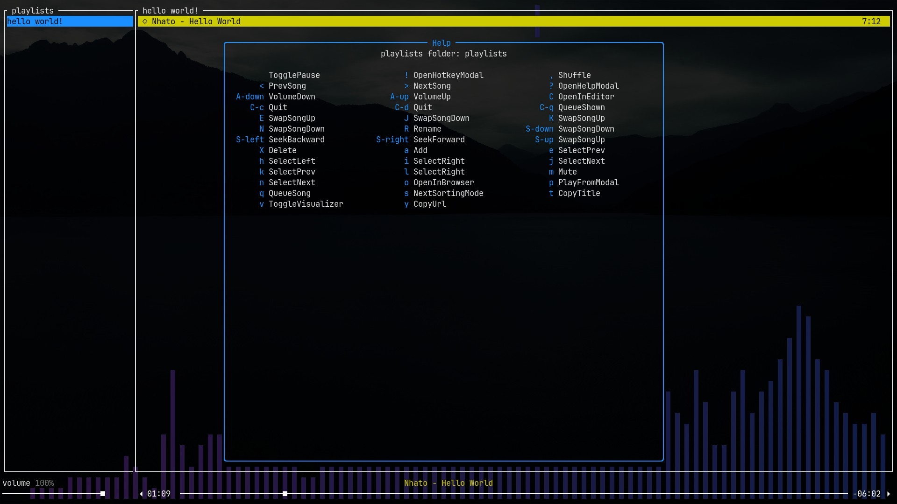

# Getting Started

## Installing
- Make sure you have the dependencies installed
- Install [the Rust toolchain](https://www.rust-lang.org/tools/install)
- Run `cargo install tori`

### Dependencies
- [mpv](https://mpv.io/)
- [yt-dlp](https://github.com/yt-dlp/yt-dlp) (recommended) or youtube-dl
- [cava](https://github.com/karlstav/cava) (optional) for the visualizer

### yt-dlp
If you want to use yt-dlp instead of youtube-dl, edit your `mpv.conf` and paste the following line:
```conf
script-opts=ytdl_hook-ytdl_path=yt-dlp
```

Either this or follow [the guide I followed :)](https://www.funkyspacemonkey.com/replace-youtube-dl-with-yt-dlp-how-to-make-mpv-work-with-yt-dlp)
## First Steps

After installing, you should now be able to run `tori` in your terminal and be greeted
with the main screen:


You can move focus between the different panes using the arrow keys, or the
vim-like keybindings `h` and `l`.

To add your first playlist, press `a` to open the add playlist prompt:


After pressing `enter`, you should see your playlist added to the list.

Now, add a song by focusing the songs pane and pressing `a` again:


Now you have your first song!


By default, pressing `enter` will play the currently selected song (but it will replace anything
that's currently playing, to append a song to the queue, press `q` instead). I also recommend
pressing `v` to enable the visualizer (requires [cava](https://github.com/karlstav/cava/) to be
installed).

tori has many configurable commands. You can press `?` to see the current bindings ~~while listening
to some Nhato tunes preferably~~:


